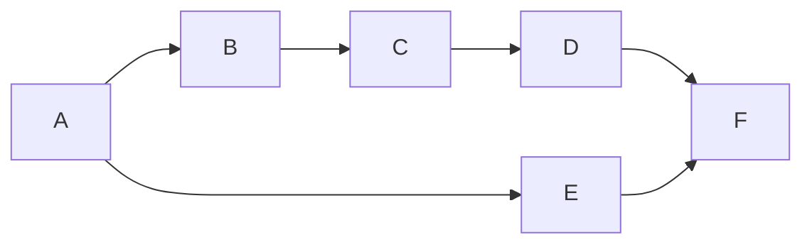
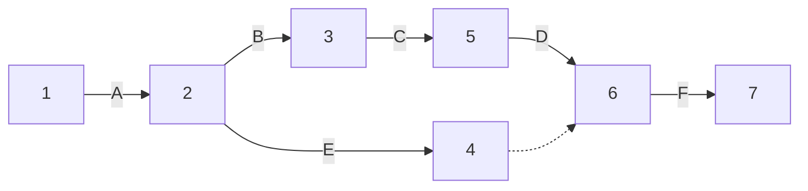
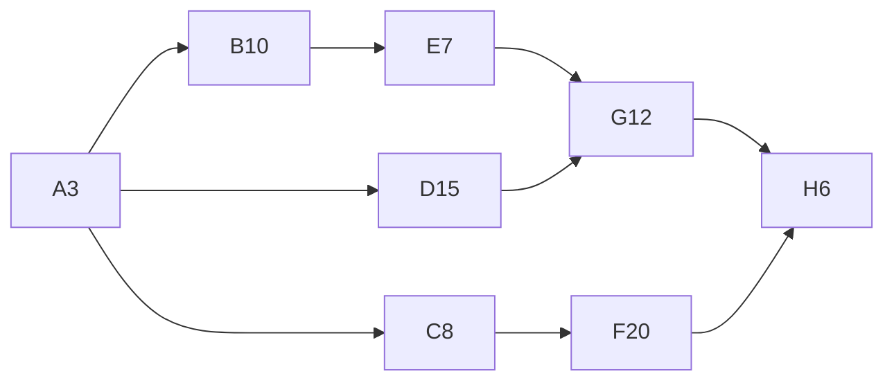
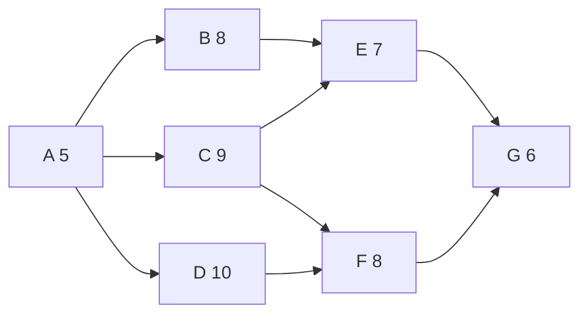

# 项目管理概论

项目：为创造独特产品、服务和成果而进行的临时性工作。

项目的特点：临时性、独特性、渐进明细，项目驱动组织进行变更

强调：

* 项目是一个过程。
* 项目可以完成一个产品。
* 项目也可以是一项服务。
* 项目时临时性的任务。
* 项目所完成的产品或服务是独特的。
* 项目是非重复性的。

日常工作的特点是**维持现状**，项目的特点是**改变（提升）**。

| 比较项   | 项目             | 运营              |
| ------------ | -------------------- | --------------------- |
| 负责人   | 项目经理         | 职能经理/运营经理 |
| 实施组织 | 项目组           | 部门              |
| 时限性   | 一次性           | 持续不断          |
| 目标     | 独特性           | 重复性            |
| 目的     | 实现目标结束项目 | 维持运营          |
| 管理方法 | 计划             | 流程              |
| 管理追求 | 效果             | 效率              |

项目与运营会在产品生命周期的不同时点交叉，例如： 

* 在新产品开发、产品升级或提高产量时； 

* 在改进运营或产品开发流程时； 

* 在产品生命周期结束阶段； 

* 在每个收尾阶段。

#### 重要人物

* 亚当 斯密：《国富论》
* 泰勒 ：“科学管理之父” 《科学管理原理》
    * 泰勒的管理思想就是在劳动分工基础之上，对某一具体工种寻找最有效率的标准化过程**。
* 亨利 法约尔：“管理过程理论之父”
    * “管理意味着预见未来。”
    * 重新定义“管理”一词：通过对资源进行计划、组织、协调和控制，来实现某一预定目标。
* 乔治 埃尔顿 梅奥 “人力资源管理之父”
    * 照明实验，福利实验，访谈实验，电话线圈管配实验
* 赫伯特 西蒙：《管理决策》 决策理论学派的代表人物
    * 决策理论：管理就是决策
    * 组织是作为决策者的个人组成的系统。
* 德鲁克：“管理学之父” 《管理的实验》 概念：目标管理
    * 一个成功的企业领导人同样能领导好一家非营利机构，反之亦然。 

#### 生命周期

从项目启动到完成所经历的一系列阶段。

启动项目，组织与准备，执行项目工作，结束项目

项目管理始终贯穿于项目的整个生命周期，对项目的整个过程进行管理。

#### 开发生命周期类型

主要针对IT或信息行业的项目开发。

* 预测型
* 适应型
    * 敏捷型
    * 增量型：每次只交付一部分，像搭积木一样逐块构建。
    * 迭代型：从粗略到精细，从模糊到清晰 ，反复求精。
* 混合型

#### 项目成功的标准

成本、质量和进度。三者之间存在相互协调和相互制约的关系。
* 项目时间↓→项目成本↑、项目范围↓
* 项目成本（资源）↓→项目范围↓、项目时间↑
* 需求变化→项目范围↑→项目成本↑、项目周期↑

#### 项目管理的知识领域

1. 整合管理
2. 范围管理
3. 时间管理
4. 成本管理
5. 质量管理
6. 人力资源管理
7. 沟通管理
8. 风险管理
9. 采购管理
10. 相关方管理

# 项目组织和项目团队

#### 项目组织

项目组织同一般组织一样，要有自己的领导（项目经理），组织的规章制度（项目章程），配备的人员以及组织文化等。

组织结构：企业正式的配置机制，程序机制，监督机制，治理机制，授权和决策机制。

组织结构类型：简单型，职能型，项目型，矩阵型

#### 项目经理

* **项目经理是由执行组织委派，领导团队实现项目目标的个人。**

* 角色：项目经理像交响乐团中的指挥。项目成员承担不同的角色，项目经理指挥协调。
* 责任：对项目成果负责。
* 知识和技能：管理知识，技术知识，理解和经验，关注行业发展，跨领域。
* 沟通：充当发起人、团队成员和其他相关方之间的沟通者。
* 成功的项目经历：持续有效地使用某些基本技能，展现出超凡的人际关系和沟通技能以及积极的态度。
* 对组织的了解：战略，使命，目的，目标，优先级，策略，产品和服务，风险，商务知识。
* 项目经理的权利：计划、组织、控制。

* 知识素质：专业技术知识的深度、综合知识的广度和管理知识水平三个方面。

# 项目启动

### 需求分析

需求是项目产生的根本前提。识别需求是项目启动的首要工作。它起始于需求或问题的产生，借宿与需求建议书的发布。

客户向承约商发送需求建议书的过程实际就是项目的招标过程。承约商进行项目识别、项目构思、项目选择，最后向客户投送项目建议书的过程实际就是项目的投标过程。

需求建议书

#### 对承约商申请书的要求

* 方法
* 可交付成果
* 进度计划
* 经验
* 人事安排
    * 成本

### 项目的选择

项目识别与需求识别是不同的，项目识别是以承约商为主体的行为，而需求识别则是以客户为主体的一种行为。

头脑风暴法

### 项目的启动

### 项目启动的工具和方法

净现值法：是指特定方案未来现金流入的现值与未来现金流出的现值直剑的差额

# 项目计划

# 项目执行与控制

# 项目收尾

# 项目成本管理

## 7.2 项目资源计划

在整个项目中为如何管理项目成本提供指南和方向。

### 8.3.2 项目活动排序的工具和方法

1. 节点法：节点法又称为顺序图法或代号网络图法，它的特点是用节点代表活动，用箭头代表……



* 不能出现无头或双头箭头，只允许出现单头箭头
* 不能存在循环回路
* 不能出现无节点的箭头
* 只能有一个起始节点和一个终止节点
* 其中的箭头要尽量避免交叉

2. 箭线图法：又称为双代号网络图法，用箭线代表活动，用节点表示活动之间的关系。



* 最乐观Ta，最悲观Tb，最正常Tc，

* CPM：关键路径法
* ES：最早开始时间
* LS：最晚开始时间
* EF：最早结束时间
* LF：最晚结束时间

* 时差：$F=LF-ES-DU=LF-EF$



```
工期：最多42天
3+10+7+12+6=38
3+15+12+6=36
3+8+20+6=37
```

|      | 最早开始 | 最早结束 | 最晚开始 | 最晚结束 | 总时差 |
| ---- | -------- | -------- | -------- | -------- | ------ |
| A    | 0        | 3        | 4        | 7        | 4      |
| B    | 3        | 13       | 7        | 17       | 4      |
| C    | 3        | 11       | 8        | 16       | 5      |
| D    | 3        | 18       | 9        | 24       | 6      |
| E    | 13       | 20       | 17       | 24       | 4      |
| F    | 11       | 31       | 16       | 36       | 5      |
| G    | 20       | 32       | 24       | 36       | 4      |
| H    | 32       | 38       | 36       | 42       | 4      |

#### 练习题

根据表中资料，画出节点图，并找出关键路径（总的时间最长的路径）。

| 活动 | 紧前工作 | 紧后工作 | 持续时间 |
| ---- | -------- | -------- | -------- |
| A    | -        | B,C,D    | 5        |
| B    | A        | E        | 8        |
| C    | A        | E,F      | 9        |
| D    | A        | F        | 10       |
| E    | B,C      | G        | 7        |
| F    | C,D      | G        | 8        |
| G    | E,F      | -        | 6        |



# 项目进度管理

# 项目质量管理

质量的定义：美国质量管理学家朱兰博士认为：质量就是产品的适用性，即产品在使用时能够满足需要的程度。

项目质量管理的定义：

* 谷津进：向消费者或顾客提供高质量产品与服务的一项活动。这种产品和服务必须保证满足需求、价格便宜和供应及时。
* 国际标准化组织：质量管理是确定质量方针、目标和职责，并在质量体系中通过诸如质量策划、质量控制和质量改进，使质量得以实现的全部活动。

项目最终产品的质量是由产品生产过程来保证的，只有保证高质量水平的生产过程，才能生产出高质量的产品。

质量管理是确定质量方针、目标和职责，并在质量体系中通过诸如质量策划、质量控制和质量改进，使质量得以实现的全部活动。

**项目质量管理包括三个主要过程：**质量计划编制、质量保证、质量控制。

# 范围管理

## 概述

项目管理的首要工作就是进行项目范围管理

项目范围是指为了成功地实现项目目标所必须完成的全部且最少的工作。有如下两层定义：

* 全部的
* 最少的

## 项目启动

## 项目范围计划

## 项目范围定义

## 项目范围确认

## 项目范围变更控制

# 作业

涉及计算，要求保留计算过程和结果

期末大作业：

* 1.电子稿写完后以2位学号_姓名命名；

    2.周三下午5点前电子稿发给班长；

    3.独立完成。

期末小作业：

​	* 周五最后一节课
